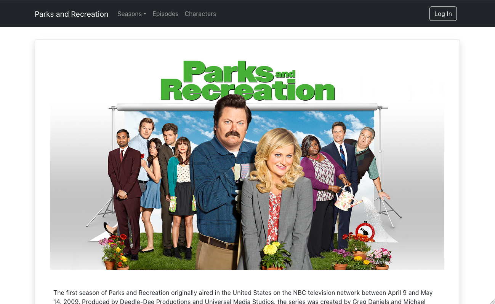
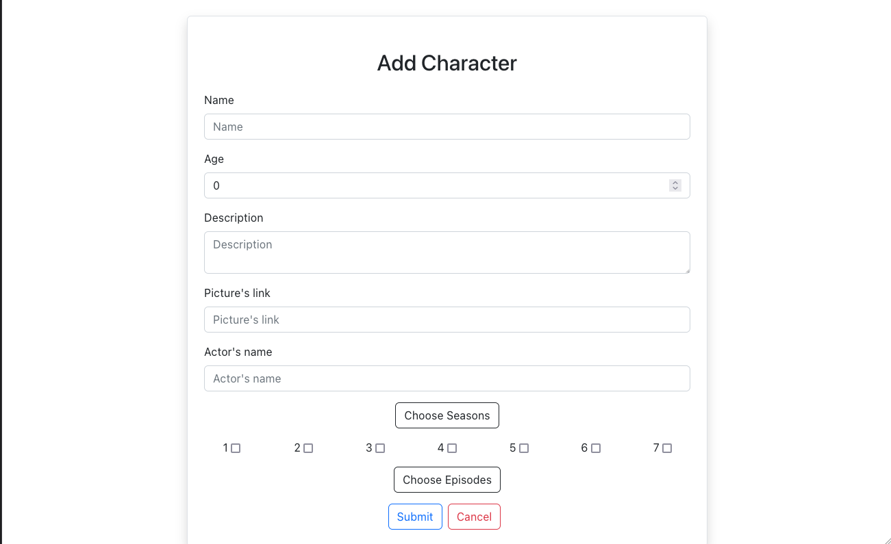
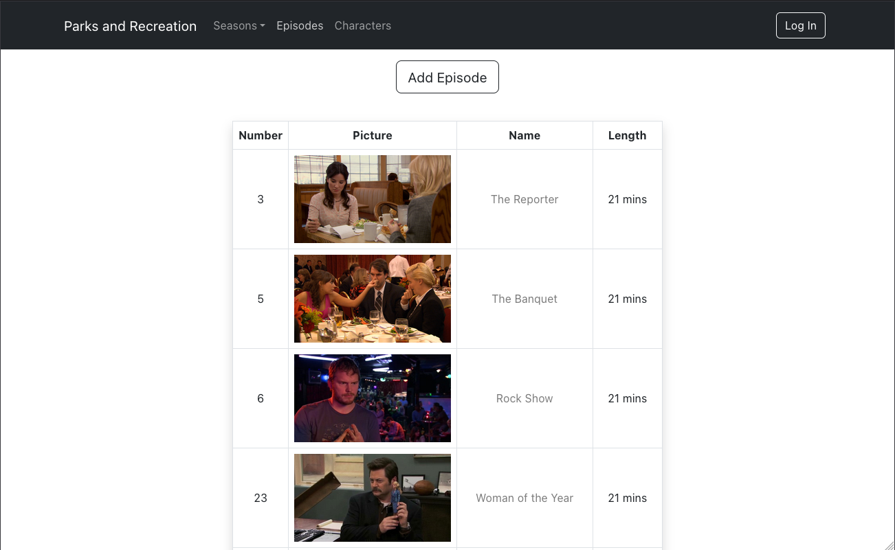
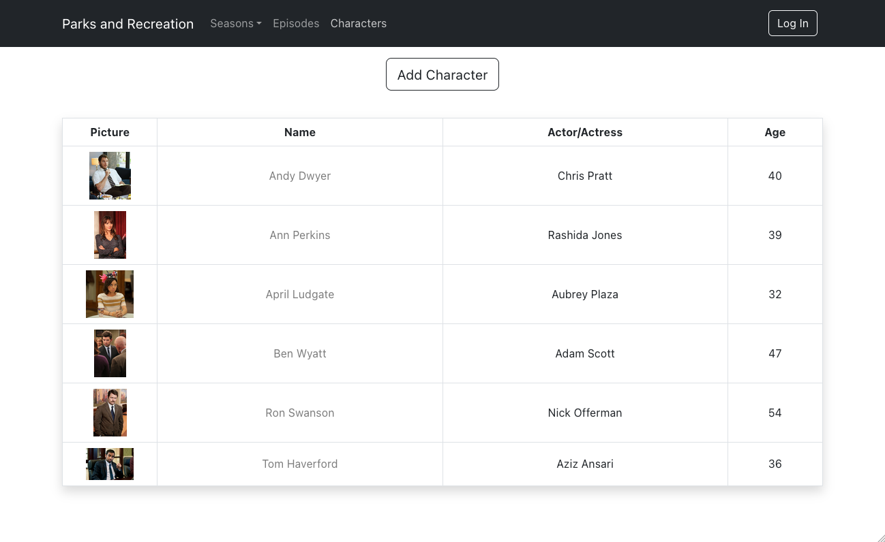
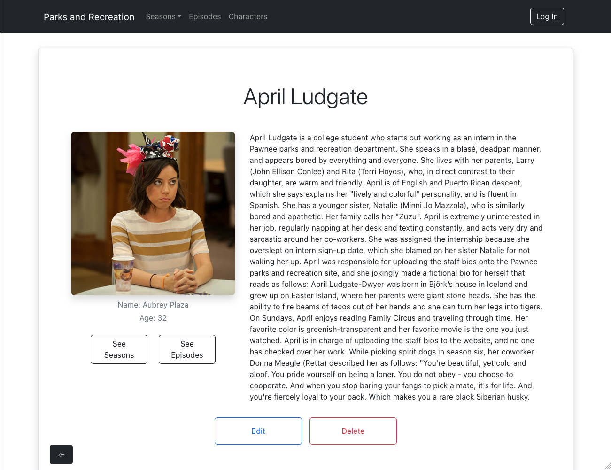
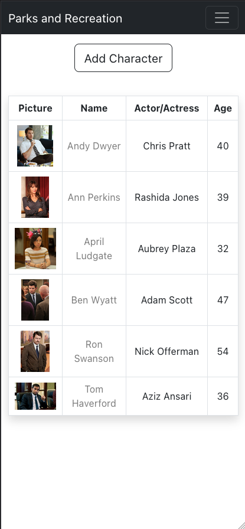
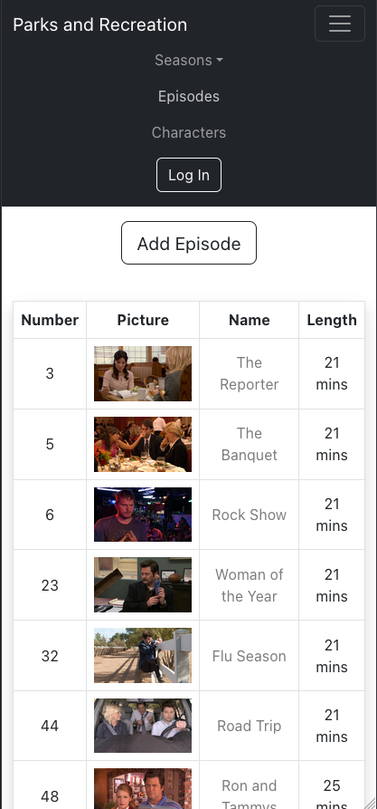
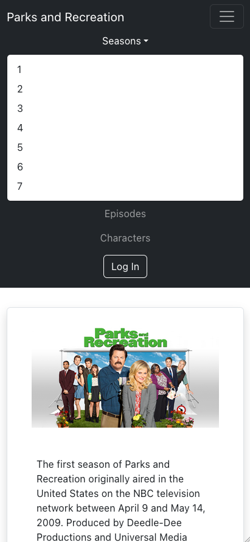

<p align="center">
  <a href="" rel="noopener">
 </a>
</p>

<h2 align="center">Parks and Recreation</h2>

---

<p align="center"> Full-stack project about TV Series Parks and Recreation, with CRUD functionality and responsive front-end.
    <br> 
</p>

## 📝 Table of Contents

- [About](#about)
- [Getting Started](#getting_started)
- [Usage](#usage)
- [Screenshots](#screenshots)
- [Built Using](#built_using)
- [Author](#author)

## 🧐 About <a name = "about"></a>

Full-stack project created with Java, Spring Boot and MySQL for backend and hosted on GCP, and React with Bootstrap for frontend, hosted on Firebase. Project has 3 main tables with connections between them (characters <--> episodes <- seasons, characters <--> seasons). When adding, updating or deleting one thing, it's also updating the connected thing.

## 🏁 Getting Started <a name = "getting_started"></a>

Project is fully hosted, so best way is to go to <a href="https://parks-and-rec-ae5dc.web.app">this website</a> and enjoying all the functionality. For running it on local server - check instructions below⤵️.

### Prerequisites

VSCode with npm installed.
IntelliJ or any other Java IDE.
MySQL installed.

### Installing

Clone down the repository/download zip folder and unarchive it.

Open terminal in front-end folder and run the command:

```
npm install
```
to install all needed dependencies after that search for all:

```
https://parks-and-rec-123.nw.r.appspot.com
```
and replace them with: 
```
http://localhost:3000
```
Run in terminal command:
```
npm start
```
Front-end is ready to use, now open the back-end folder in IntelliJ (or preferred IDE) and in all controllers change:
```
@CrossOrigin("https://parks-and-rec-ae5dc.web.app")
```
to: 
```
@CrossOrigin("http://localhost:3000")
```
and go to application.properties, delete everything what's in there and paste:
```
spring.datasource.url=jdbc:mysql://localhost:3306/parksandrec?createDatabaseIfNotExist=true
spring.datasource.username=YOUR_USERNAME_HERE
spring.datasource.password=YOUR_PASSWORD_HERE

spring.jpa.hibernate.ddl-auto=update
```
and then run the application by going to ParksAndRecBackEndApplication file and clicking the play button next to: 
```
public class ParksAndRecBackEndApplication
```

## 🎈 Usage <a name="usage"></a>

- After either going to <a href="https://parks-and-rec-ae5dc.web.app">this website</a> or doing everything above, you can add new character/episode by going to Characters/Episodes and clicking on Add button on top.
- To see the information about character/season go to the one you want by clicking on the name in the list view.
- To then edit character/season click the edit button at the bottom of the page.
- When adding/editing characters you can choose what seasons/episodes you want to add them in, you have to first choose the season, then the episodes from that season will apear after clicking the button.
- To go back click Cancel button.

## 📸 Screenshots <a name = "screenshots"></a>










## ⛏️ Built Using <a name = "built_using"></a>

- [MySQL](https://www.mysql.com) - Database
- [Spring Boot](https://spring.io/projects/spring-boot) - Back-end
- [React JS](https://reactjs.org) - Front-end
- [Bootstrap](https://getbootstrap.com) - Front-end styling

Hosted on:
- [Google Cloud Platform](https://console.cloud.google.com/) - Back-end with database
- [Firebase](https://firebase.google.com/) - Front-end

## ✍️ Author <a name = "author"></a>

- [@DorBia](https://github.com/DorBia)

